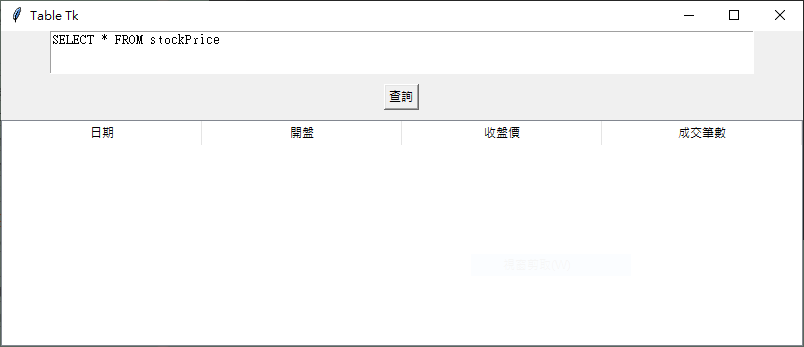

# tkinter

# run
```
(myenv11_02) PS D:\work\git\python_crawler\08-tkinter> python .\helloTk.py  
(myenv11_02) PS D:\work\git\python_crawler\08-tkinter>
(myenv11_02) PS D:\work\git\python_crawler\08-tkinter> python .\textBoxTk.py
(myenv11_02) PS D:\work\git\python_crawler\08-tkinter>
(myenv11_02) PS D:\work\git\python_crawler\08-tkinter> python .\tableTk.py   
```




