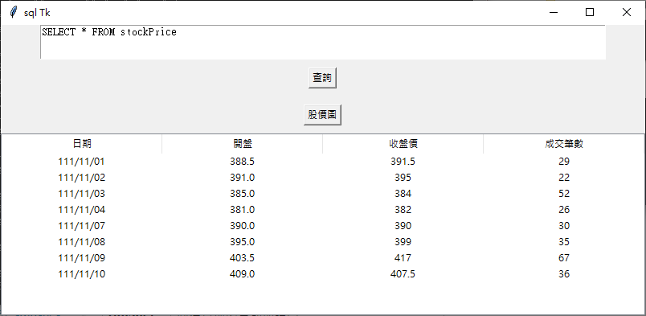
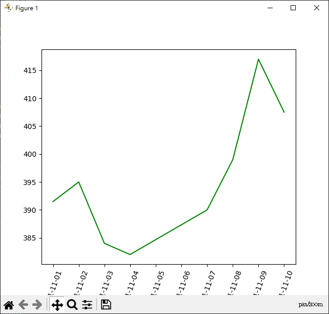

# sqlTkChar
+ 開出一個視窗,按查詢 button後,讀出sqlite DB資料到視窗 
+ 按股價圖 button後,畫出 股價圖

## install
```
pip install matplotlib
```

## run
```(myenv11_02) PS D:\work\git\python_crawler\10-sqlTkChar> python .\sqlTkChar.py
0111-11-01
0111-11-02
0111-11-03
0111-11-04
0111-11-07
0111-11-08
0111-11-09
0111-11-10
```




